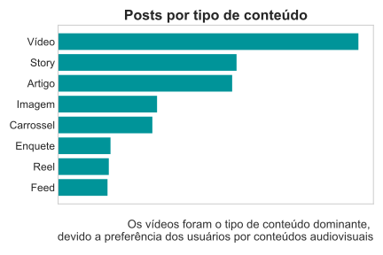
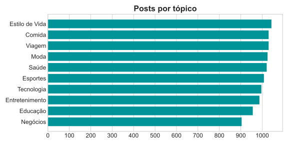

# 📊 EDA com dados de redes sociais 
Nesse repositório, desenvolvi uma análise de dados sobre **postagens em redes sociais no Brasil**, com o objetivo de entender os fatores que mais chamam a atenção dos brasileiros na internet 📱

O dataset, extraído do **Kaggle**, apresenta informações dos posts, como:  

- Plataforma (Instagram, Youtube, etc)
- Tópico do post
- Insights gerais (likes, comentários, visualizações, etc)


## 🎯 Objetivo da análise

Neste processo, meu foco foi entender as **características gerais dos posts no dataset**, identificando as características de uma amostra do conteúdo produzido para redes sociais no ano de 2025.

Para identificar esses fatores, obtive as seguintes métrcas sobre os dados:

- Volume mensal de posts
- Quantidade de posts por tipo da publicação
- Quantidade de posts por idioma
- Quantidade de posts por tópico
- Quantidade insights por plataforma 
- Porcentagem de posts virais

## 🔎 Resultados da análise

Em resumo, alguns fatores importantes sobre a utilização das redes sociais pelos brasileiros, entre eles:

- Tendência por consumir mais conteúdos audiovisuais do que textuais
- Preferência por temas relacionados a saúde e estilo de vida

Abaixo estão algumas visualizações obtidas no decorrer do projeto 📈

</img>
</img>

## 🛠️ Como executar as análises?

1 - Abra o **terminal (bash)** e clone o repositório para sua máquina:
```bash
git clone https://github.com/samuelsilva07/analise-redes-sociais.git
```
2 - Acesse o local do projeto:
```bash
cd "analise-redes-sociais"
```
3 - Instale as dependências do projeto, através do comando:
```bash
pip install -r requirements.txt
```
4 - Abra o notebook da análise:
```bash
jupyter notebook notebooks\eda-redes-sociais.ipynb
```
---
Obrigado por visitar esse repositório! 😀
